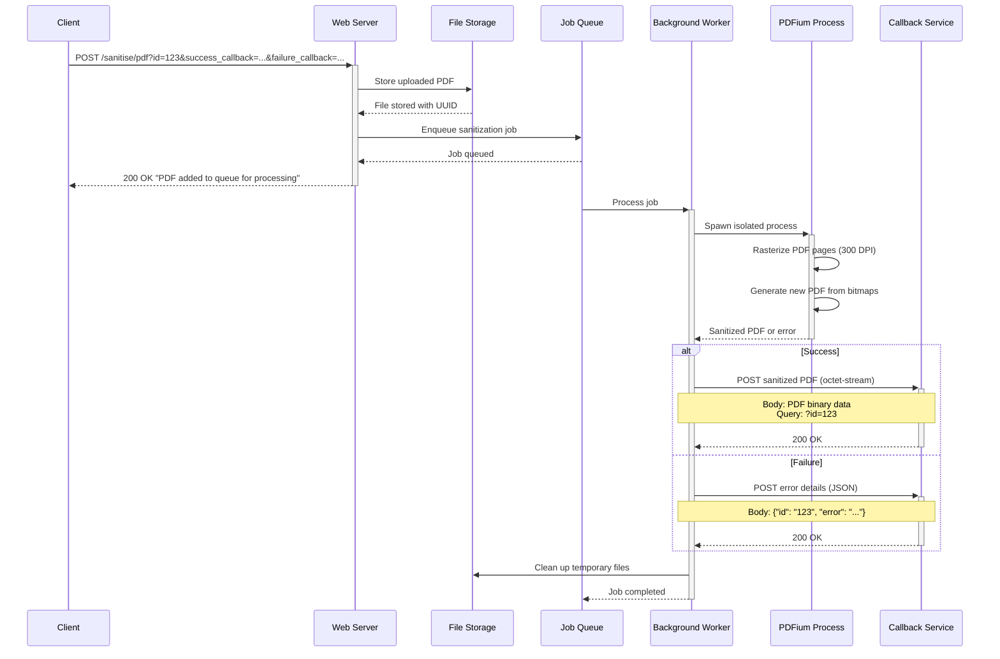
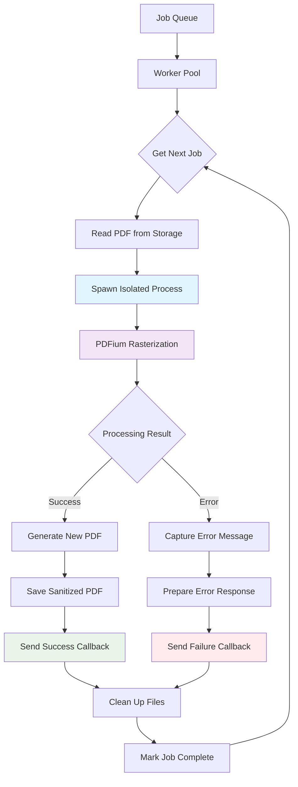

# Sanitisium

**A secure PDF sanitization service that eliminates threats using the [Content Disarm and Reconstruction strategy](https://en.wikipedia.org/wiki/Content_Disarm_%26_Reconstruction)**

Sanitisium is a defensive security tool that provides complete PDF sanitization by regenerating documents from scratch. Instead of attempting to clean malicious content, it takes screenshots of each page and creates an entirely new PDF, ensuring complete elimination of embedded threats like malicious JavaScript, forms, links, and other potentially dangerous elements.

## Why Sanitisium?

PDF documents can contain various security threats:
- **Malicious JavaScript** embedded in forms and annotations
- **Exploit payloads** targeting PDF reader vulnerabilities  
- **Phishing links** and malicious external references
- **Form-based attacks** that execute on user interaction
- **Buffer overflow exploits** in malformed PDF structures

Traditional PDF sanitization approaches attempt to parse and remove threats, but this can be bypassed by sophisticated attacks. Sanitisium takes a different approach: **complete regeneration**.

## 🏗️ Architecture

Sanitisium is built as a Rust workspace with three main components:

### 📦 Components

- **`cli/`** - Command-line interface for direct PDF processing
- **`sanitiser/`** - Core library handling PDF regeneration using PDFium
- **`web_server/`** - HTTP API with background job processing and callback system

### 🔒 Security Approach

1. **Complete Regeneration**: Converts each PDF page to 300 DPI bitmaps, then creates a new PDF
2. **Process Isolation**: Uses `procspawn` to run PDFium in separate processes, preventing memory corruption
3. **Memory Management**: Processes pages in batches to handle large documents efficiently
4. **Background Processing**: Queues sanitization jobs via SQLite-backed job system

## 🌊 Request Flow



## 🔄 Background Worker Processing



## Quick Start

### Prerequisites

- [Rust](https://www.rust-lang.org/) >= 1.88.0
- PDFium (vendored for Mac ARM and Linux x64)

```shell
curl --proto '=https' --tlsv1.2 -sSf https://sh.rustup.rs | sh
```

### Command Line Usage

Process a single PDF file:

```shell
cargo run -p cli --release -- input.pdf --output clean.pdf
```

### Web Server Usage

Start the web server:

```shell
cargo run -p web-server --release
```

Submit a PDF for sanitization:

```bash
curl -X POST "http://localhost:8000/sanitise/pdf?id=my-doc-123&success_callback_url=https://my-service.com/success&failure_callback_url=https://my-service.com/failure" \
  -H "Content-Type: application/pdf" \
  --data-binary @document.pdf
```

## Callback System

### Success Callback
When PDF processing succeeds, your service receives:
- **Method**: POST
- **Content-Type**: `application/octet-stream`
- **Body**: Sanitized PDF binary data
- **Query Parameters**: `?id=your-document-id`

### Failure Callback
When processing fails, your service receives:
- **Method**: POST  
- **Content-Type**: `application/json`
- **Body**: `{"id": "your-document-id", "error": "error description"}`

## Development

### Running Tests

```shell
# Run all tests
cargo test

# Run web server integration tests
cargo test -p web-server

# Run with logs
TEST_LOG=1 cargo test
```

### Configuration

The web server uses YAML configuration with environment variable overrides. See `resources/config/base.yml` for available settings.

### Docker Support

```shell
# Build and run with Docker Compose
docker-compose up --build
```

## Technical Details

### PDF Processing Pipeline

1. **Page Rasterization**: Each page converted to 300 DPI bitmap using PDFium
2. **Batch Processing**: Pages processed in chunks of 5 to manage memory
3. **Image Regeneration**: Bitmaps converted to PNG, then embedded as JPEG (70% quality)
4. **PDF Assembly**: Temporary PDF chunks merged into final document
5. **Cleanup**: All temporary files removed after processing

### Performance Characteristics

- **File Size**: Sanitized PDFs are typically 5-10x larger due to its image-based approach
- **Processing Time**: Varies by document size and complexity (typically 1-5 seconds per page)
- **Memory Usage**: Batched processing keeps memory usage reasonable for large documents
- **Concurrency**: Supports concurrent processing of multiple documents

### Dependencies

- **PDFium**: PDF parsing and rendering (via `pdfium-render`)
- **printpdf**: New PDF document generation
- **Actix-web**: HTTP framework with OpenTelemetry tracing
- **Apalis**: Background job processing with SQLite storage
- **procspawn**: Process isolation for PDFium operations

## 📝 License

MIT License - see LICENSE file for details.
